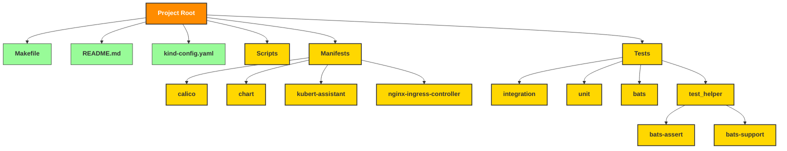

# Kubert AI Assistant Lite

Kubert AI Assistant Lite is a lightweight open-source project that enables the deployment of a Kubernetes cluster using [Kind](https://kind.sigs.k8s.io/){:target="_blank"} and the deployment of Kubert AI Assistant with a single AI agent, the Kubectl Agent. 

*Kubectl AI Agent At Work: Retrieving pod status*{: .fw-300 }

## Key Features

- **Kind Cluster Deployment**: Leverage Kubernetes in Docker (Kind) to create a local Kubernetes cluster for testing and development, enabling rapid prototyping and experimentation.
- **Kubectl AI Agent**: An AI-powered agent capable of executing `kubectl` commands based on user prompts. This agent enhances productivity by automating routine Kubernetes management tasks.
- **Automation and Insights**: Gain insights into your Kubernetes environment through automated command execution and analysis provided by the AI agent.

## Project Architecture

The architecture of Kubert AI Assistant Lite consists of several key components that work together to create a robust and flexible local Kubernetes environment using Kind. Here’s a detailed breakdown:

- **Local Environment**: The project is initiated on the developer's machine, which runs Docker to host the Kubernetes cluster using Kind. This setup ensures a lightweight and easily configurable development environment.

- **Kind Cluster**: Kind (Kubernetes in Docker) is used to create a local Kubernetes environment within Docker containers. It provides a lightweight and configurable cluster setup, ideal for testing and development purposes.

- **Kubert AI Assistant**: Deployed within the Kind cluster, the Kubert Assistant serves as a management layer that interprets user prompts and coordinates actions within the cluster. It acts as a bridge between user commands and Kubernetes operations.

- **Kubectl AI Agent**: This AI-powered agent operates within the Kind cluster, executing `kubectl` commands based on natural language prompts. It offers automated management and diagnostic capabilities, simplifying Kubernetes operations and enhancing productivity.

- **User Interaction**: Users send commands through a prompt interface, which are interpreted by the Kubectl AI Agent to perform the necessary operations within the Kubernetes cluster.

This architecture enables seamless interaction and automation within a localized Kubernetes environment, making it an ideal tool for developers and DevOps professionals looking to streamline their Kubernetes workflows.

## Components

The Kubert AI Assistant Lite project is organized into several key components, each contributing to the overall functionality and structure of the project. Below is a breakdown of these components, aligned with the project tree structure:

- **Project Root**: The top-level directory containing all project files and directories. It serves as the entry point for the entire project.

  - **Makefile**: A build automation tool file containing a set of directives used to compile and manage the project. It simplifies complex command sequences, making it easier for developers to execute tasks.

  - **README.md**: A markdown file providing an overview of the project, including usage instructions, setup steps, and additional resources for users and contributors.

  - **kind-config.yaml**: Configuration file used to set up the Kind Kubernetes cluster, defining the cluster's specifications and resources.

- **Scripts**: A directory containing various shell scripts used to automate deployment, cleanup, validation, and other utility functions.

  - **cleanup.sh**: Script for cleaning up resources and reverting changes made during deployment.

  - **deploy.sh**: Script to deploy the Kubert Assistant Lite application onto the Kubernetes cluster.

  - **utils.sh**: Contains reusable utility functions shared across multiple scripts to enhance efficiency and consistency.

  - **validate-tools.sh**: Validates the presence and versions of required tools, ensuring that all prerequisites are met before proceeding with operations.

- **Manifests**: A directory containing YAML files and Helm charts for Kubernetes deployments and configurations.

  - **calico**: Includes deployment configurations for Calico, a networking and network policy engine for Kubernetes.

  - **chart**: Contains Helm chart files, including templates and values used to deploy and manage Kubernetes components.

  - **kubert-assistant**: Holds the Helm chart values YAML files for the Kubert Assistant component, specifying values and settings for its operation.

  - **nginx-ingress-controller**: Contains deployment configurations for the NGINX Ingress Controller, managing external access to services within the Kubernetes cluster.

- **Tests**: A directory with test scripts and support files for unit and integration testing, ensuring the project's reliability and performance.

  - **integration**: Contains integration test scripts that verify the functionality of different components working together.

  - **unit**: Includes unit test scripts focusing on individual components and their isolated behavior.

  - **bats**: Holds test files using BATS (Bash Automated Testing System) for bash script testing.

  - **test_helper**: Provides helper scripts and libraries supporting the testing process, including assertions and support functions.
  
    - **bats-assert**: A library providing assertions for BATS test scripts.

    - **bats-support**: A library offering support functions for BATS, aiding in test setup and execution.

## Goals

- **Simplify Kubernetes Setup**: Provide an easy-to-use platform for setting up local Kubernetes clusters, reducing the barrier to entry for developers new to Kubernetes.
- **Testbed for AI-Driven Automation**: Offer a sandbox environment where developers can explore the capabilities of the Kubectl AI agent and experiment with AI-driven Kubernetes management.
- **Enhance Developer Productivity**: Allow developers to focus on higher-level tasks by automating routine Kubernetes operations through intelligent command execution.

## Getting Started

To get started with Kubert Assistant Lite, follow the installation guide and deploy your local Kubernetes cluster using Kind. Explore the capabilities of the Kubectl AI agent and discover how it can streamline your Kubernetes workflows.

For detailed installation instructions, please refer to the [Installation Guide](installation.html).

## Contributing

We welcome contributions from the open-source community to help improve Kubert Assistant Lite. Whether you want to report a bug, suggest a feature, or contribute code.

## License

Kubert Assistant Lite is released under the MIT License. See the [LICENSE](https://github.com/TranslucentComputing/kubert-assistant-lite/blob/main/LICENSE){:target="_blank"} file for more details.
